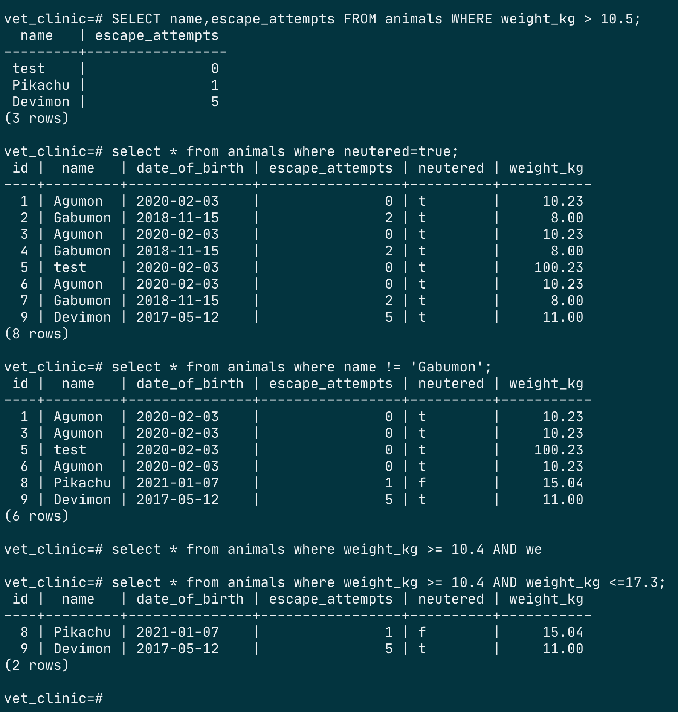

# Vet Clinic Database

> This repo involves the schema, queries and data used during the microverse psql learning track.. Most of the query structures you will ever need building a project. From creating tables to joining and querying them.

# SCREENSHOT PAGE

## Getting Started

To get a local copy up and running follow these simple example steps.

### Prerequisites

- A modern upto-date browser
- Text Editor or IDE

### Setup

1.  Clone the Repo or Download the Zip file or `https://github.com/billionsjoel/Vet-clinic-database.git`.
2.  `cd/Vet-clinic-database`

### Install

After cloning the project you need to run these commands

- `npm install` `This command will download all the dependancies of the project`
- `npm run start`
## Authors

👤 ** Atugonza Billions joel **

- GitHub: [@billionsjoel](https://github.com/billionsjoel)
- Twitter: [@billionsjoel](https://twitter.com/BillionsJoel)
- LinkedIn: [billionsjoel](https://www.linkedin.com/in/billionsjoel/)

## 🤝 Contributing

Contributions, issues, and feature requests are welcome!

Feel free to check the [issues page](https://github.com/billionsjoel/metrics-app/issues).

## Show your support

Give a ⭐️ if you like this project!

## Acknowledgments

- Hat tip to anyone whose code was used
- Inspiration
- etc

## 📝 License

This project is [MIT](./MIT.md) licensed.
